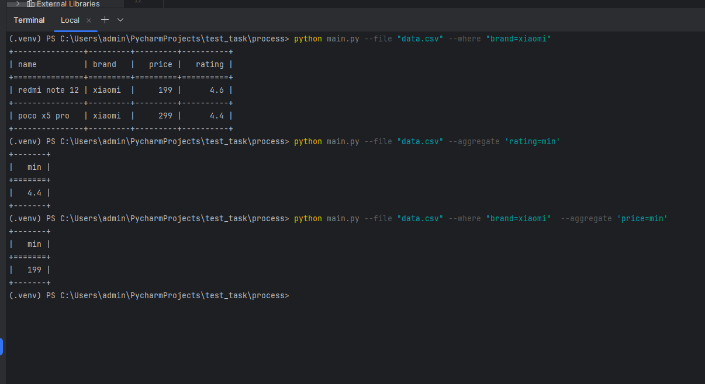

Простой скрипт для фильтрации и агрегации данных из CSV-файлов.

Установите зависимости из файла req.txt:

```bash
pip install -r req.txt
```

Примеры:
```
python main.py --file "data.csv" --where "brand=xiaomi"  --aggregate 'price=min'
```

```
python main.py --file "data.csv" --aggregate 'rating=min'
```
 

